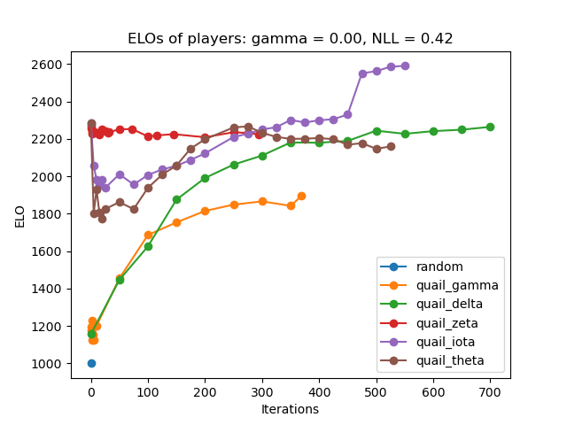
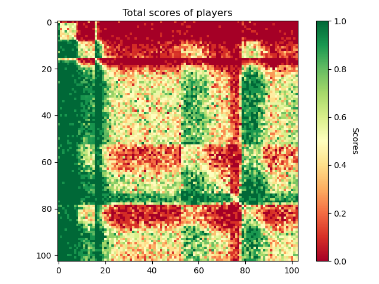

# sprl

`sprl` is a scalable self-play reinforcement learning framework,
which began as a final project for the MIT graduate class
6.8200 Computational Sensorimotor Learning in Spring 2024.

The project aims to replicate the techniques of
[AlphaGo Zero](https://www.nature.com/articles/nature24270)
in order to solve two-player zero-sum abstract strategy games,
especially ones involving the placement of stones on a board,
such as Connect Four, Pentago, Othello (Reversi), Gomoku, Hex, and Go.

The code can run on single machines or distribute across a compute
cluster such as [MIT SuperCloud](https://supercloud.mit.edu/).

## Code Organization

Python code is distributed across the `/src`, `/scripts`, and `/tests` directories.
Much of the code in `/src` is deprecated: it is an older and slower implementation
of the entire framework and much of it has been replaced with C++.

C++ code is available inside the `/cpp` directory, which is further subdivided.

In the current form of the code, the self-play data collection steps
are performed in C++. The game logic and Upper-Confidence Tree search
algorithm must be implemented in C++, as well as interface code to
save the data in a format parsable by `numpy`. Details such as
sub-tree reuse, virtual losses, data/inference symmetrization,
Dirichlet noise mixing, and parent Q-initialization are handled here.

Meanwhile, the training loop is implemented in Python. A standard
PyTorch training loop is implemented to improve the convolutional
neural network. The code is responsible for collating self-play data,
splitting it into training and validation sets, and tracing the networks
for inference in C++ using LibTorch.

## How to Develop and Build

For the Python code, you will need standard packages such as `numpy`
and `torch`. I would recommend creating a virtual environment
and installing them there. You can see the full list of requiements
in `requirements.txt`.

Be sure to also run `pip install -e .` to install the `src` package,
so all the `import` statements work properly.

For the C++ code, you will need a suitable compiler and CMake.
You will also need a LibTorch distribution, which you can learn
to setup from the [docs](https://pytorch.org/cppdocs/installing.html).

### Linux

On Linux, simply `wget` and `unzip` the LibTorch ZIP archive into
your favorite location on your location. To build,
navigate to the `/cpp` directory and then run the commands:

```shell
mkdir build
cd build
cmake -DCMAKE_PREFIX_PATH=/absolute/path/to/libtorch ..
cmake --build . --config Release
```

This will build the files into the `/cpp/build` directory.

### Windows

On Windows, install LibTorch using the
[PyTorch website](https://pytorch.org/get-started/locally/)
into your favorite location on your computer.

If you are using the CMake extension in VSCode, I would recommend
adding the path to your LibTorch installation to the CMake
configuration settings. You can find this by clicking the
cog wheel icon in the CMake extension side bar.
Then, add an entry with item `CMAKE_PREFIX_PATH` and value
`/absolute/path/to/libtorch/share/cmake/Torch`, e.g.
`C:/libtorch/share/cmake/Torch`.

Then, to build, open a new workspace inside the `/cpp` folder
and click the Build button with the CMake extension in VSCode.
You will probably need to build using a Visual Studio compiler
on Release mode (I couldn't get G++ to work).

To actually run any resultant executable, you will also
need to copy every `.dll` file from `/libtorch/lib` into
the same directory as the executable to be dynamically linked
at runtime.

## How to Test

We use the Catch2 testing framework for C++ code, and it should
compile automatically. If you're on Windows, you may need to copy
`.dll` files into `/cpp/build/tests/Release` or similar.

To run the tests, navigate to the `/cpp` directory and run
the commands:

```shell
cd build
ctest -C Release
```

## Starting Training Runs

1. First, you need to compile an executable such as
   `/cpp/build/GoWorker.exe` from `/cpp/src/GoWorker.cpp`.
2. Then, set the configuration json files in `/config`. A copy
   of these files is saved in `/data` when the experiment begins.
3. When working on MIT SuperCloud, the top-level executable
   `/go_main.sh` spawns all of the required processes
   for you. Edit the contents of `/go_main.sh` to adjust resource
   allocation.
4. Under the hood, `/go_main.sh` simply runs many instances of `/go_worker.sh`
   and `/go_controller.sh` in parallel. In non-SuperCloud contexts,
   edit the contents of those files to suit your environment.

**Remember to recompile the C++ code if you change the constant values!**

Right now, the code is designed to train the neural network via DDP
on four "controller" machines with 2 V100 GPUs each, and collect data
across 8 "worker" machines with 48 CPU cores each.

There are two main operational modes, set by the `sync` flag in
`/config/config_selfplay.json`.

1. When `sync = True`, the processes operate in lock step, where the workers will
   wait for the latest controller model to save before beginning their tree search,
   and vice-versa.
2. When `sync = False`, the workers and controller operate asynchronously and
   continuously. Workers run tree searches with the latest models saved,
   and controllers train models off the latest datasets saved.

In both modes, the system is robust against workers failing.
Newly spawned workers and controllers first check for existing
progress in `/data`, re-starting from the latest save-points automatically.

## Running Tournaments

Tournaments are one of the ways we gauge the performance of the trained models.
Traced models saved in `/data/models` can be evaluated against each other in
a tournament, where each model will play games against each other indefinitely.
A python program can scoop up the results and display them in win-rate heatmaps
and elo charts.

An example output is shown below. There are `6` "teams" of
models competing against each other, including `5` generations of `quail` models
plus a `random` team.





## Running the Discord Bot

We also created a discord bot to keep track of the training progress and
keep us motivated! See `dopamine/README.md`.